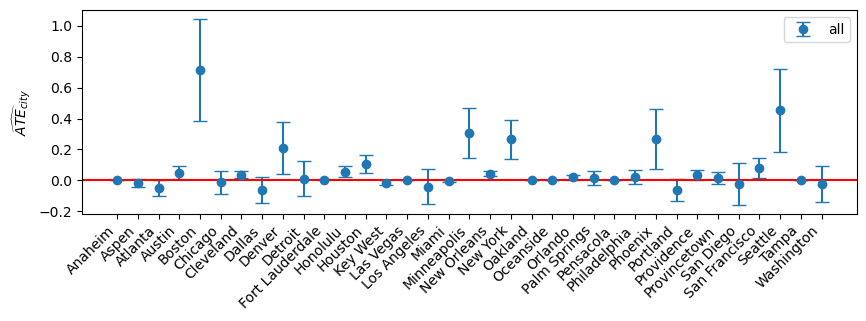

[](https://www.python.org/downloads/release/python-3816/)
[](https://pypi.org/project/pandas/1.5.3/)
[](https://pypi.org/project/numpy/1.23.5/)
[](https://pypi.org/project/matplotlib/3.7.1)
[](https://pypi.org/project/notebook/6.5.3)

# Pride Events Causal Inference

Pride events have been an important part of the LGBTQ+ community's history and continue to be held across the United States.
However, there is debate about the potential risks of these events, with some claiming that they may lead to an increase in hate crimes against the LGBTQ+ community.
Media coverage of these events often highlights the threats and harassment that organizers and member of the LGBTQ+ community face in the lead-up to the events, which raises questions about the necessity of these events.
Some argue that these events are critical for informing the public and raising awareness about LGBTQ+ issues, while others believe that they incite opposition and create conflict.
In this project, we aim to investigate the causal relationship between LGBTQ+ events and hate crimes committed against the community in the United State of America.
Specifically, we will examine whether holding an LGBTQ+ event in a particular location causes a change in the number of hate crimes committed against the LGBTQ+ community in that area.
By focusing on crimes with an anti-LGBTQ+ motive, we can provide insight into the potential impact of these events on the safety and well-being of the community, and hopefully provide valuable information for developing strategies to support and protect the LGBTQ+ community.

## Table of Contents

- [Pride Events Causal Inference](#pride-events-causal-inference)
- [Table of Contents](#table-of-contents)
- [Requirements](#requirements)
- [Repository Structure](#repository-structure)
- [Usage](#usage)
- [Results](#results)
- [Team](#team)
- [References](#references)

## Requirements

The code was tested on python v3.8.16 with the following libraries:
| Library | Version |
| ------------- | ------------- |
| `matplotlib` | `3.7.1` |
| `numpy` | `1.23.5` |
| `pandas` | `1.5.3` |
| `beautifulsoup4` | `4.11.2` |
| `notebook` | `6.5.3` |
| `scipy` | `1.10.1` |
| `tqdm` | `4.65.0` |
| `scipy` | `1.7.1` |
| `python` | `3.8.16` |
| `ipython` | `8.11.0` |
| `ipywidgets` | `8.0.4` |

## Repository Structure

```batch
├── Data - A folder containing all the databases raw data for analysis
|   ├── PrideEvents
|   |	├── extract_parades_dates.ipynb - A python botebook for extracting the raw pride events data 
|   |	├── hand_filtered.xls - An xls after manual filtering of the extracted dates
|   |	└── Other data files
|	└── Other data files
├── Output - A folder that contains pickles of the LATEs calculated as well as graphs outputs
├── db_preprocessing.py - a python file containing DB pre-processing functions to be used in the main analysis notebook
├── paper_figures_and_tables.ipynb - A python notebook for generating the figures and tables presented in the final project paper
├── main_analysis_notebook.ipynb - The notebook responsible for loading the DBs, analysing them and saving the calculates RD LATEs
└── causalInference_allcode.ipynb - All the python code together, here as backup.
```

## Usage

1. Clone the repo.
2. Run `paper_figures_and_tables.ipynb` to regenerate the graphs.

If you want to start from scratch:

1. Clone the repo.
2. Run `Data\PrideEvents\extract_parades_dates.ipynb` to exract the pride events DB - This might take more than 4 hours.
    - Make sure to cleanup the data, as the website might contain non-existing pride events (e.g., after being canceled because of COVID-19).
3. Run `main_analysis_notebook.ipynb` to preprocess the DBs, and run the RD analyses - This might take more than 6 hours total.
4. Run `paper_figures_and_tables.ipynb` to regenerate the graphs.

## Results



Based on all the data, it is evident that there is no clear-cut answer.
Most per-city ATEs are close to zero, with a wide confidence interval that crosses into the negative ATE domain, which means we can't determine anything robustly.
A few cities show an increase in hate crimes against the LGBTQ+ community around the time pride events are occurring. These results are perliminary and show that furthur analysis is possible and even warranted, to help conclude if a casual connection exist.
Further research could help determine future policy about increased security and informing the public about the ongoing struggle of reaching acceptance.

## Team

[Maor Sulima](https://www.github.com/maorsulima), Hila Manor

## References

1. [MIT Election Data and Science Lab](https://electionlab.mit.edu/data#data). U.S. House 1976–2020, 2017.
2. [MIT Election Data and Science Lab](https://electionlab.mit.edu/data#data). U.S. President 1976–2020, 2017.
3. [MIT Election Data and Science Lab](https://electionlab.mit.edu/data#data). U.S. Senate 1976–2020, 2017.
4. [WayBack Machine.](https://web.archive.org), 2023.
5. Federal Bureau of Investigation. [Hate crime statistics in 2021: Uniform crime reports](https://www.fbi.gov/services/cjis/ucr/hate-crime). 2021.
6. Gregory Smith, Alan Cooperman, Jessica Martinez, Elizabeth Sciupac, Conrad Hackett, Besheer Mohamed, Becka Alper, Claire Gecewicz, and Juan Carlos Esparza Ochoa. America’s changing religious landscape. Washington, DC: Pew Research Center, 2015.
7. Spartacus. [Gay travel index](https://spartacus.gayguide.travel/blog/spartacus-gay-travel-index/). 2012-2017,2020,2021.
8. Night Tours. [Night tours gay nightlife and travel guide](https://www.nighttours.com/gaypride/), 2007-2022.
